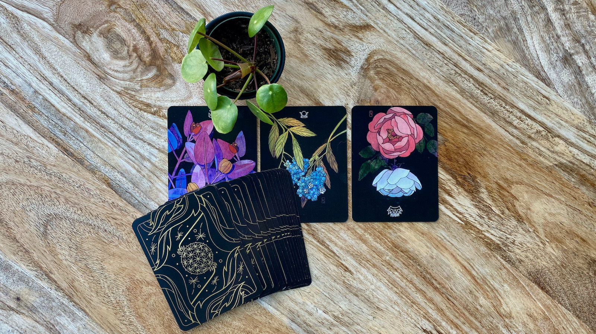
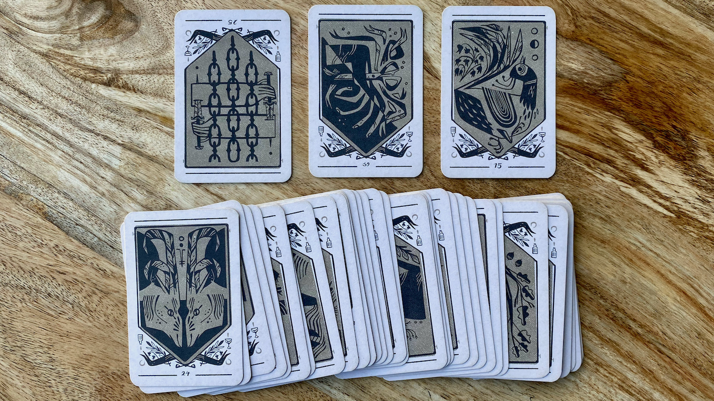
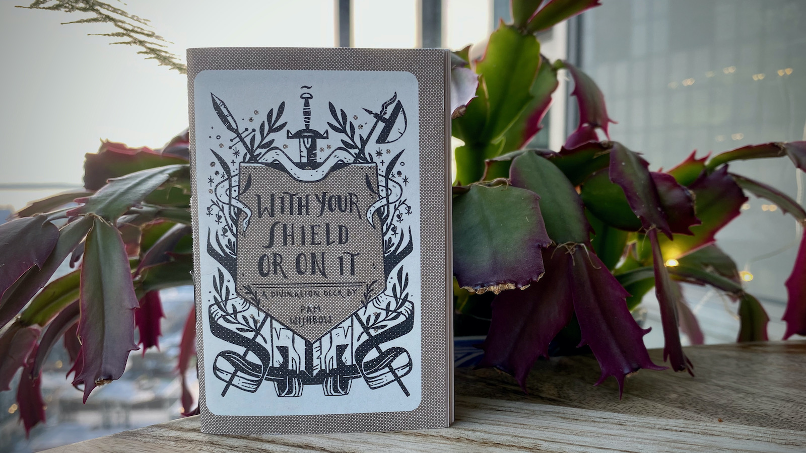
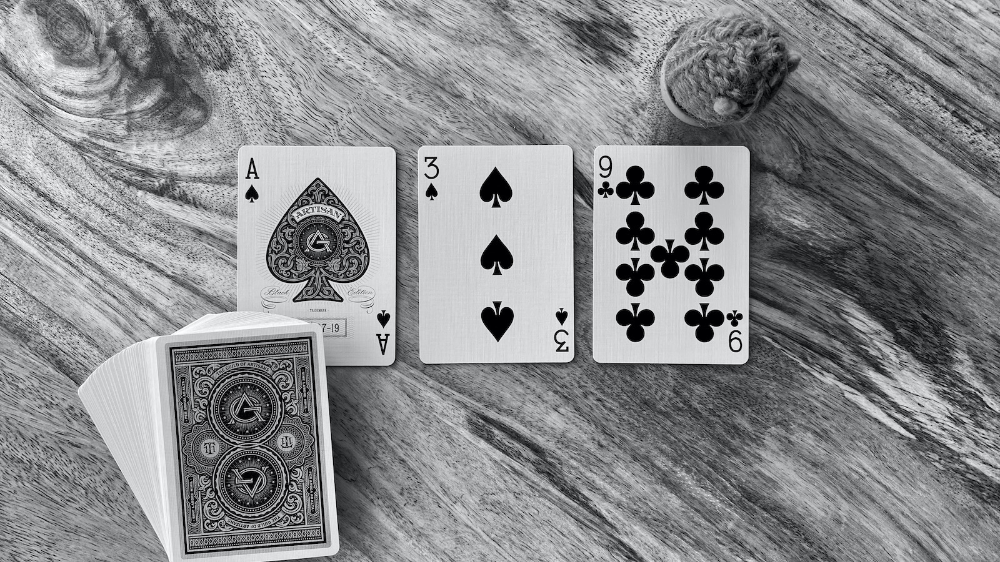

import { DescribedImage } from 'components/DescribedImage'

Hi friends. I want to share one of my more controversial engineering management techniques with you: **divination**. It's a visualization technique, a framework of using the lens of the present to examine the past to understand the future. I believe in divination, especially as tool for aligning my intellect and emotions. Whether or not you believe in any kind of spiritual component to divination is secondary to the fact that it's an effective triage tool for deep thinking and planning.

<DescribedImage caption={'The Botanica Tarot (major Arcana) by [Kevin Jay Stanton](https://www.patreon.com/kevinjaystanton)'}>

  
</DescribedImage>

I'd like to share my favorite divination technique: the three card draw. The three card draw works by means of automatic association. We, as humans, want there to be patterns to things, order to chaos, and so we will bend unrelated happenstance into canonical truths. As such, we can trick ourselves into uncovering unexpected truths by looking for patterns where none should exist.

<DescribedImage caption={'**With Your Shield On It**, a divination deck by Seattle artist [Pam Wishbow](https://www.pamwishbow.com/).'}>

  
</DescribedImage>

This is my favorite divination deck. It is _perfect_ for three card draws. The deck comes with a wee booklet that offers a possible interpretation of the cards. This is important; it gets the mind racing with possibility. Pam calls out at the beginning that these are _possible interpretations_, and that we, the diviners, should look for our own meanings.

<DescribedImage caption={'The wee booklet offering possible interpretations of the cards.'}>

  
</DescribedImage>

Here's how it works. Shuffle or mix the cards. Don't think about it too much. Take a moment to focus your thoughts on what you'd like to understand better. A question or situation or uncertain future. Flip over three cards and place them in a row. Now... read them. On the left is how you got here. In the center is the situation before you in the present. On the right, where the future may take you unless you will it otherwise. You'll notice the cards can be facing toward you or away. I usually ascribe meaning to the facing. Toward me is a more denotative, concrete interpretation. Away is connotative or associative meanings. Maybe the absence of, or longing for. Maybe an assumption that needs closer examination. Sit with your cards and let them tell you a story. Sit with the story and decide what you'll do with it. 

That's it. The only rule of divination is that you must tell the **truth** as you understand it. Most of the times, this is a personal thing, done in private, and those can be difficult truths. Keep that in mind and give yourself permission to think and feel what you need to.

Now, **With Your Shield On It** is a fancy deck, but the process works fine with any collection of cards. The important thing is to have _variables_. Some differences in the cards that will encourage your brain to do that pattern-finding thing. Three is a powerful number, so with any three card draw I am looking for three kinds of variables.

Here's what I'm hoping is a very accessible example. Let's consider this ordinary pack of playing cards (actually [this is an extraordinary pack of playing cards](https://www.studioonfire.com/store/artisan-playing-cards)). For the story of this draw, I find three variables (suit, facing, and value) for consideration.

<DescribedImage caption={'Ordinary playing cards.'}>

  
</DescribedImage>

These cards are telling a story of growing problems, a garden out of control. Notice the meticulous nature of the Ace of Spades. It's detailed and singular, reminding me of all my grand plans in the past, and how earnest I was in my belief that everything would be work out if I kept focused. Later, I recruit others to my plans. The one becomes three (a powerful number, I keep mentioning). A team (or coven) in place, and the plan is intact.

Let's pause. This is where I am now. Does it match my situation? At first, I thought not but then I see the bottom spade facing away. Something's not quite right. The plan may look and sound the same, but I need to dig deeper. Am I missing something?

The nine of clubs warns me of a garden overgrown. Exponentially increasing concerns, orderly spades turned unruly clubs. I need to step back, regroup, reconsider, realign before things spin out of control.

That's it! My brain is focused; I can think deeply on what's really troubling me. I'm clearly unsure about my team's roadmap, and it probably has something to do with the team composition (that one spade facing away&mdash;what are you trying to tell me?). This example is only lightly contrived; I scribbled thoughts as fast as I could to capture the essence of my divination. You don't need a fancy deck of mysterious cards&mdash;though that is both lovely and gratifying&mdash;to get started. Find something accessible, some cards or dice or tea leaves that speak to you, and give it a try. Let me know how it goes.

Ok friends, that's all I've got. Take care, talk soon, and stay safe. 💕
