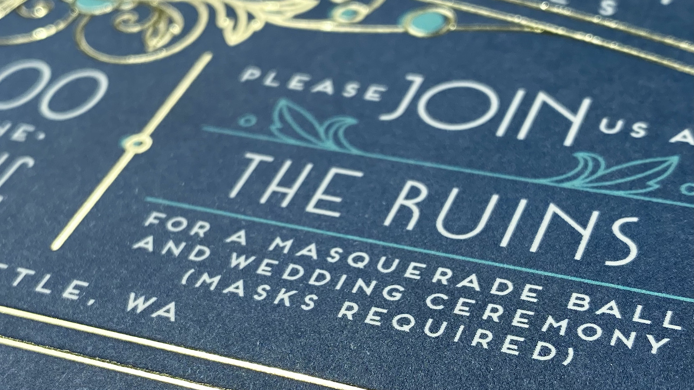

import { DescribedImage } from 'components/DescribedImage'

I asked my partner to marry me on 24 February 2019. [She said yes](https://twitter.com/_jnf/status/1099792115306061824) and we set about planning a wedding. It was to be a masquerade ball&mdash;_masks required!_&mdash;scheduled for 10 October 2020. I pictured all my loved ones, family born and found, dressed in extravagent costume, dancing and laughing.

<DescribedImage caption={'masks required'}>

  
</DescribedImage>

We got as far as printing formal invitations before COVID-19 changed everyone’s plans, and _masks required_ took on new meaning. We will still have our event, our moment. Just not this year. Maybe next. But I am not writing this today to talk about weddings or pandemics. I want to talk about masks, and not the kind you wear to a party or to avoid infection.

I wear identity masks. Layers of them. And, with the love and support and patience of my partner, my family, my friends, and a likely-exhausted therapist, I’ve been peeling masks. One by one.

I’m really damn good at my job and that would be the least interesting thing about me, except that my job is to elevate others; my job is to make everyone around me really damn good at and really damn visible in their jobs. I’ve reached the limit of what I can do in my present circumstance, so I need to make some changes. I need to elevate myself. I need to make myself visible. I need to take off my masks.

For a long time, my comfort in these masks was a source of strength. I’ll show you what I mean. First, the mask I’ve worn longest: I’m mixed-race, Mexican-American. Half my family is brown (and beautiful); the other half is (very) white (also beautiful). But I walk around in this white skin and ain’t no one in the history of me ever jerked a thumb in my direction and said, “oh, yeah, you’re looking for that Latino dude over there.” And I know&mdash;_I know_&mdash;how this skin determines so much about my experience in this world. But I look in the mirror and I see my dad, my cousins, mi familia, and I know&mdash;_I know_&mdash;what that means to me and how I’ve shaped my world around that experience.

What do I mean? I mean I know I got jobs because (at least in part) white people in power trust other white people. I mean I know why the bank manager was so (embarrassingly) apologetic when turning me down for a bank loan, quietly pulling me into a private office and handing me a cup of coffee before breaking the news that my credit was bad. And I know that when I run a hiring loop or speak at a conference or write performance reviews or stand in line at the DMV, my white skin is what people see first. And, for better or worse, it changes things.

But I’m Latinx every bit as much as I’m white, and I’m proud of my heritage and my family.

Oh, and fuck ICE.

Here’s another&mdash;I have ADHD and a stammer/stutter. I think these things are related, but I don’t know. Either way, my brain is different than most everyone’s. I want to use a metaphor to illustrate what it’s like to be me and use words. Have you ever watched/listened to an expert user of screen readers? A person with low/limited vision or blind person well acquainted with a screen reader listens and navigates with a startling rapidity. That’s kind of what it’s like in my head. Before I say a word aloud, I say it in my head to ensure that I _can_ say it aloud. Sometimes I can’t, and, trying to force it is what makes me stutter.

I mean this literally. There’s a mechanism in which I try a word out in my brain before deploying it to my body. It’s fast, like a screen reader, and, if I’m focused, I can catch a stumbling word and swap it, thesaurus style, for something I can say in that moment. To practice, I listen to recordings of myself (classroom lectures, readings, conference talks) and pick out the places I stuttered or stumbled or had an awkward substitution. Then I practice versions of those lines with the words that made me stutter and with equivalents that are easier for me to say. Also, I can pick out the tiny pauses in my speech that are evidence of a swap. Most folks can’t, or are at least polite enough to not call it out.

I’m often lauded as an excellent public speaker and it always makes me blush (sometimes it makes me cry) because it is very much a hard-won skill. Having good discipline and practice to manage my stutter (and ADHD, which I’m not going to talk about here, now) doesn’t make me neurotypical. Here are some words that often trigger my stutter: dignity, developer, Jeremy.

Two Saturdays ago I recited poetry aloud to my partner in the park while she painted. 

>
  However, she makes everything 
  feel like midnight.
>
  The streets are empty and her car 
  is the only one on the road

That’s [Rudy Francisco](https://www.iamrudyfrancisco.com/), btw, and I love his poetry. I rarely stutter when reading aloud. Especially about love.

Here’s a mask. I’ve worn it since childhood. Few have seen the me without it. It’s been the hardest to peek behind, let alone shed. I’m queer. I’ve known and seen myself as queer about as long as I’ve had a connotation of the word available. Growing up, in high school and college, the word I had was bisexual. It’s a fine word, but inaccurate. Or incomplete, really. Bisexual, whether I use my early understanding (sexual and/or romantic attraction to both men and women) or my current-era definition of attraction to my gender and other genders is still centering the conversation on my externalities&mdash;who I am attracted to, who I wanna share a bed with.

And that’s ok. That’s an important facet of identity but it’s only a facet. It’s incomplete.

I’m (gender)queer. Specifically, I’m [greygender](https://lgbta.wikia.org/wiki/Greygender). For awhile, I thought maybe _agender_, but no. That's not quite right. Here’s why: one of the truest sentences I know is, “I am my mother’s son.” That resonates in the core of my being. Coming to terms with being someone’s _son_, having never been a _husband_ (I am a spouse) or _brother_ (I am a sibling) took years. Greygender is the answer, or the closest I’ve come, like finding the one shirt that fits on the rack. May not be the one I was looking for, but it’s nice to find _something_.

I only experience gender in my relationship to others. That’s it. _I am my mother’s son._ Beyond that, I’m a person. A person who’s best and worst qualities have fuck-all to do with being a man (or a woman). I’m just a person. But those en-gendering (sorry) experiences are deeply meaningful and I treasure them. _I am my mother’s son_ isn’t just a true sentence, it’s a joyful one.

I’m out to a few folks. A college friend that knew me as a bisexual man, a small friend-Slack of mostly strangers. It’s been a long and evolving conversation between my partner and I. Years really. I never planned to be out publicly, mostly out of fear and no small amount of self-loathing. To be very honest, I don’t know if I’ll ever publish this essay. I’m writing it for me, and... well, that might be enough.

I said at the beginning of this that I need to make some changes. Being openly, unflinchingly queer is the change. I could do that without writing a self-indulgent essay, but I feel like I owe an explanation to those closest to me. Those that have known me over years. Especially other LGBTQ+ folks in my life. They inspire me and being able to say aloud (alone in my apartment, in this essay and, hopefully, in front of coworkers and friends) that I am queer and worth knowing, worth loving, is because of them.

All these masks have helped me build and hold onto a successful career, a comfortable lifestyle. I’ve done my best to make and hold space for others, lending privilege, wedging open doors, building literal and metaphorical platforms. But sometimes it feels hollow, and it’s often lonely. I want the world to know me without these masks, and I want to experience the world without worrying if there's a seam showing. I want my success to come from a place of honesty and joy. Not performative conformity.

I want to love myself. Like I love you.

Hi. My name is Jeremy, though I often go by jnf (_jay-en-eff_) because it looks cool and I don't stutter when I say it. My pronouns are [they/them](https://pronoun.is/they/.../themselves). I'm Latinx, and I'm queer.
