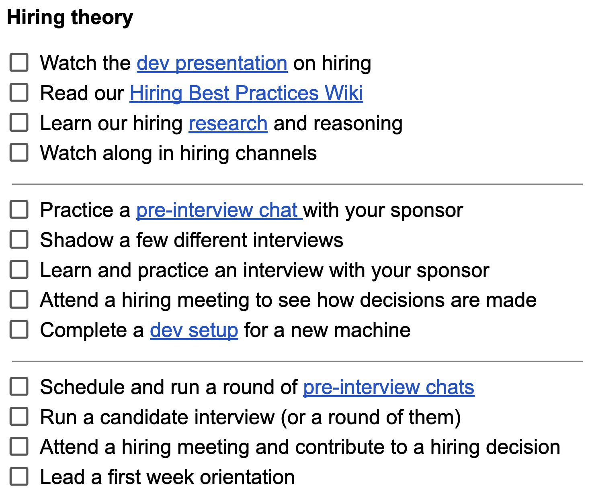

import { DescribedImage } from 'components/DescribedImage'

## Author’s Note

_I originally authored this essay for LeadDev; it was published in May 2022 ([link](https://leaddev.com/career-paths-progression-promotion/how-build-apprenticeship-program-engineering-managers)). A lot has changed in the year-and-change since, but fundamentally I'm still both very proud and very much a believe in this program. Apprenticeship is an underutilized model in the tech industry, and as the gap widens between computer **scientists** and computer **programmers**, the need for alternate models to train and qualify workers will also grow. This is even more true for technical leadership roles, where technical expertise necessarily informs sound leadership and strategic decisions._

_-jnf, 20231010_

---
In 2021, Bandcamp faced a conundrum. We needed to grow the ranks of our engineering leadership, but hiring externally was difficult. This was partly due to our uncommon perspective on the role of an engineering manager (more on that soon). But more importantly, it was because we knew there was tremendous talent in our existing teams and a desire for professional growth. We wanted to develop the talent we already had.

With that in mind, we devised a supervised apprenticeship program, aimed at guiding experienced individual contributors (ICs) into becoming first-time engineering managers (EMs). Apprenticeships are a proven tool for guiding newcomers into a profession, giving them the structure and space they need to practice critical skills in lower-stakes situations.

Here I’m sharing how the program came to be and what we’ve learned along the way. I hope this can be a lighthouse along the shore for you and your teams as you explore how to identify, support, and empower emerging leaders.

### How management works at Bandcamp

When we say ‘engineering manager,’ we all picture something a little different, informed by our experience and knowledge. No two EM roles are identical; any fungibility in a management role comes from the intersection of the individual manager’s ability to adapt and the support they receive from their peers and leaders.

This perspective is especially important at Bandcamp, as we define engineering managers as engineers who manage. This means that EMs contribute to feature development alongside their IC peers. EMs are not, as a rule, the team leads (TLs) that manage the roadmap and software architecture. This distinction is critical to not overwhelming managers. EMs manage people; TLs manage technical design, implementation, and feature roadmaps.

This form of matrix management frees EMs to focus their effort on interpersonal and organizational communication, the well-being of their reports, and quality-of-life improvements for all of engineering. Similarly, this separation empowers TLs to focus on their team roadmaps, collaboration with peer departments like product and design, and excellence in technical implementation.

### Why we went with apprenticeships

Bandcamp writes things down. That’s what stood out to me when I joined as an engineering manager in July 2021. Every answer to every question included a link to the internal wiki. My welcome doc was a transit hub, a subway map of further reading, historical context, and meeting notes.

Fully distributed since inception, Bandcamp’s internal culture and professional norms center on writing things down, creating reference materials, and asynchronous communication. Sure, we’re loud in Slack and we author countless Google Docs (honestly, I’m not sure if I’m proud or embarrassed at how many Sheets are lurking in my Drive), but the wiki is canon. It’s not perfect – we spend a lot of hours writing and tidying, and there’s no small amount of deprecated information – but I’ll take it, especially having been hired into a leadership role.

There’s a wiki page about internal promotions–criteria and responsibilities–for engineering managers. It includes this summary list:

- Superb communication skills
- **Experience leading and mentoring engineers**
- Time management skills
- Demonstrated affinity for our values
- **A seasoned, reliable engineer whose performance has been steady for at least six months (preferably longer)**
- Contributions to the improvement of the organization through external outreach, internal knowledge sharing, process and practice improvements, etc.

All reasonable expectations for a manager, right? But the two points in bold present a conflict for many ICs: **becoming a seasoned, reliable engineer** is a full time job; **leading and mentoring** are skills substantively different from that full time job.

Bandcamp has only hired externally for technical management twice, including me, so this criteria is written with ICs in mind, many of whom won’t have prior leadership experience. For these folks, it has been unclear how to learn leading and mentoring skills and balance that with being an excellent software engineer.

After some discussion, the EM group forged a hypothesis: a supervised apprenticeship would create the opportunities and structure for interested ICs to learn and practice the necessary skills to transition into an entry-level EM role. Alex Hindley, our then-director of engineering, drafted the initial program specifications, drawing on her experience building the EM ranks and the existing wiki documentation about the EM role at Bandcamp.

After review, discussion, and updates, we launched a pilot program in January 2022. Four ICs with tenures ranging from seven months to seven years volunteered for the pilot.

### How the apprenticeship works

Much of this explanation comes from Bandcamp’s internal wiki documentation, which I’ve adapted and summarized for clarity and relevance.

#### It’s about the trip, not the destination

The program is designed to stimulate learning and provide opportunities, rather than as a series of hurdles to overcome. It’s a sign-posted road to professional growth, but certainly not the only one. There’s neither a minimum nor maximum timeline for the program, though it was designed to be completed in around six months. Many things can impact how long the program lasts: an apprentice can pause and resume, slow their efforts to focus on their IC responsibilities, repeat certain activities to improve mastery, or have additional activities introduced by their sponsor. Also, some requirements for the program are situational, and may not be always available.

Individuals curious about management can start down the road and then decide it’s not for them. They can exit the apprenticeship at any time with no judgment or negative impact on their career at Bandcamp. And the skills gained from time spent in the program are beneficial in all roles – improved communication skills, a greater understanding of how the engineering organization works, maybe even a bit of empathy for those in management roles.

Finally, it’s not a requirement to complete the apprenticeship to be considered for a management role, and there’s no guarantee that completing an apprenticeship will immediately (or otherwise) lead to a promotion. When EM roles become available, any interested IC is welcome to apply. Apprentices at any stage of the program will have their progress considered as evidence of their strengths as a candidate, and those who have completed the program will be given priority if there are multiple candidates.

#### Built-in support

Every apprentice has at least one official sponsor who will track their progress, offer feedback and support, and organize opportunities for the apprentice to practice their skills. Usually, the sponsor is the apprentice’s manager, but that’s not a requirement. An activity or requirement of the program is complete when the apprentice and sponsor agree it is. While in the program, apprentices need to take time away from their usual team responsibilities. The sponsor works with the apprentice and their team lead to find the appropriate balance. This too is part of the program. Balancing implementation and management responsibilities is a challenge all engineering managers at Bandcamp face, although one that we consider worthwhile to strike.

#### Measurable progress

The program divides management skills into four competencies: Cohort Wellbeing, Communication, Hiring Theory, and Mentoring. Each of these categories is further divided into three tiers of mastery: Developing, Proficient, and Advanced. In each cell of the resulting matrix of competencies are several activities and checkpoints meant to help the apprentice gain practical experience with their sponsor’s guidance.

These matrix entries aren’t exhaustive. They’re a starting point, some known-knowns about being an EM at Bandcamp. Often, the activities within a competency build upon each other as an apprentice moves through the tiers. In the Developing level, for instance, many of the activities are passive. Apprentices watch, read, shadow, and review. As the apprentice gains experience, the expectations are more active. They will research, propose, practice, organize and lead.

All the specifics for the program exist in long form on the wiki, but to facilitate easier progress tracking we also provide the competencies matrix in checklist form as a Google Doc for apprentices to copy, annotate, and discuss with their sponsor. The checklist version is intentionally sparse; it’s a conversation starter, not a report card.

<DescribedImage caption={'one quadrant of matrix: hiring theory'}>

  
</DescribedImage>

#### Other expectations

While we’ve tried to tailor the program to be a functional roadmap, we know it’s incomplete. It’s not feasible to fully encompass in a series of documents the entire nuance and practice of people leadership. Still, it’s important to plainly state the expectations of apprentices for their time during the program. The wiki documentation lays these out so that there’s a shared understanding between everyone involved–apprentices, their team leads and peers, their sponsors, and other EMs.

### What we’ve learned

Going back to the hypothesis, we believe completing the apprenticeship is an accessible and effective way to close the gap between being a seasoned and reliable IC and an effective leader and mentor. As of May 2022, our pilot apprentices are working their way through the program, so while we have not wholly tested our hypothesis, we have learned a few things:

#### Sponsor is a verb

Our initial conception of the apprenticeship was a largely self-guided program. However, much of the content within the program requires coordination between apprentices, existing EMs, and their sponsors. For example, to gain experience with meeting facilitation, the program requires apprentices to act as host for some of the regular department meetings. That seems reasonable enough on paper, but in practice, the agendas and content of those meetings are worked out in advance in conversations and channels to which apprentices don’t have direct access. Therefore, it’s the sponsor that must speak up in those situations to advocate and create the opportunity for their apprentice.

Other ways in which sponsoring has become an active role is in organizing reading materials, reviewing proposals from apprentices, and volunteering apprentices for those many one-off, in-the-moment organizational needs EMs often fulfill, like evaluating a potential third party solution or revitalizing aging documentation. There’s a lot that happens in closed meetings, private channels, and email chains that apprentices won’t see and won’t know about. Without sponsor intervention and advocacy, apprentices will never have the opportunity to grow into the role.

#### It’s easy to get discouraged

This program attracted some of our most motivated, curious, and ambitious ICs. The breadth of documentation and sponsor support allows for graceful entry into the program, but, like with any other skill, it takes time and effort to progress. Coupled with the irregular availability of some items in the competencies matrix, a couple of our apprentices reported feeling discouraged. They worried that they were ‘taking too long’ in the program, or concerned that a particular activity wouldn’t be available for a long time. These are reasonable frustrations. Reassuring apprentices that they’re not on a strict timeline helps. Future iterations of the program will need to feature reliably available activities in all areas of the competencies matrix.

#### Cooperation vs competition

Perhaps the deepest disagreement among the existing EMs was whether the apprenticeship was inherently cooperative or competitive. On one hand, there are a limited number of EM roles, so apprentices will need to compete with other apprentices and applicants. On the other hand, the role requires significant cooperative skills, like mentoring, meeting facilitation, and performance coaching. Mutual learning from a similarly skilled peer group is a powerful complement to both self-guided learning and sponsor coaching.

In early conversations with their sponsors, apprentices felt competitive and were hesitant to engage with each other. As the apprenticeships progressed and their confidence increased, they became more eager to interact and learn from each other. I imagine each cohort of apprentices will need to find their own balance, and we can help them by ensuring there’s a mix of activities and experiences suitable for solo and group effort.

#### This is only the beginning

Some apprentices have expressed hesitance in believing the apprenticeship will adequately prepare them for people leadership. They were both comforted and alarmed to learn that this was the fundamental question we were all trying to answer.

What has really helped is reminding apprentices that they’re training for a new role. The apprenticeship is helping them become junior (or entry-level) engineering managers, much like a university degree or bootcamp program helps someone become an entry-level software developer. That comparison has helped; it frames the concern in a way that was exciting and showed apprentices that, with time and effort, they’ll become skilled managers just like they progressed from entry-level to experienced software engineers.

### Final observations

Overall, the program is working. Our apprentices are learning and proving (to themselves and their peers and sponsors) that they’re ready to be leaders and mentors. Bandcamp was able to take this program from conception to pilot in a few months because of the trove of existing documentation about hiring and being an engineering manager, and deep, meaningful support from senior leadership.

I’m confident that our current apprentices will complete the program and be compelling candidates for upcoming EM roles at Bandcamp. At the current pace, the pilot apprenticeships will be completed in the summer of 2022. After that, we’ll host a retrospective with everyone involved, and decide whether we’ve proven or refuted our hypothesis. Either way, we’ll iterate and try again. The hypothesis validation and retrospective observations will shape how the apprenticeship program evolves.

I want to reiterate that the structure of the program I’ve described is tailored for how front-line management works at Bandcamp. Your organization’s perspectives and practices are likely different, so what I describe may not work well with your team. That said, I do believe the overarching ideas are sound.

You don’t need it, but, if it helps, know that you have full permission to take the ideas here and adapt them however will best serve your teams. I’d love to see similar programs help new leaders thrive. If you do come up with something cool and impactful, reach out and let me know!
