## Author’s Note
_Hello! This talk was recorded, so once the video is released I’ll post it here. This presentation made me nervous--more nervous than I’d anticipated--and I think it’ll come through in the video. Still, it’s an important topic and I’m grateful for the opportunity to share my perspective and experience. Everyone in Pittsburgh was lovely, and I had so many great conversations afterward and throughout the conference._

_Thank you to all the organizers, volunteers, and sponsors for the opportunity. Thank you to the folks that attended this talk for listening. And thank you Bren for being my sounding board, collaborator, and editor. Yinz are the best._
_-jnf, 20190929_

___

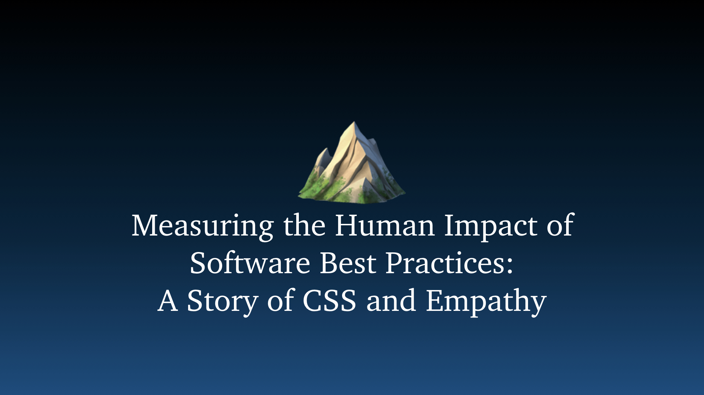

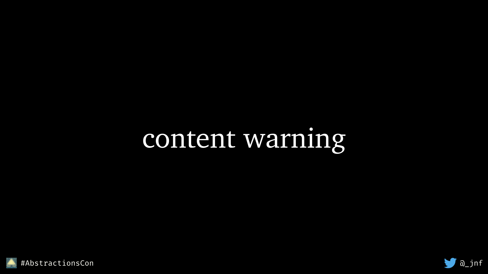
This presentation includes discussion of the complexities of life in countries with challenged, if not collapsed, economies (primarily Venezuela). There are also several gifs and video files throughout. Most are of text transitions, but one gif feature some flashing colors. It’s called out with a separate warning beforehand.

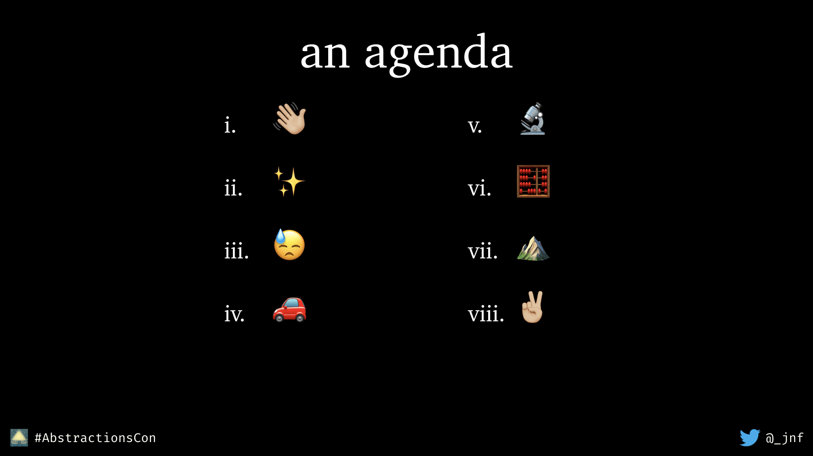

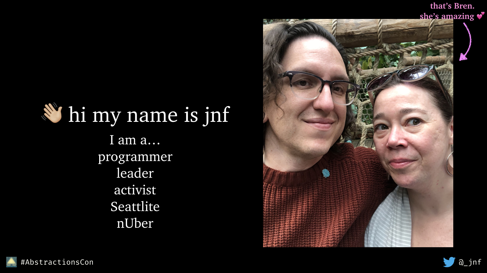

Today, I’m an engineering manager within the Uber Advanced Technology Group, an entity dedicated to bringing safe, reliable self-driving transportation to everyone, everywhere. That’s relatively recent. I came to Uber via the acquisition of Mighty AI, a Seattle-based startup with the mission to deliver high-quality training data for use primarily in computer vision and autonomous driving applications. I’m speaking today about events that took place during my time at Mighty AI, before the acquisition.

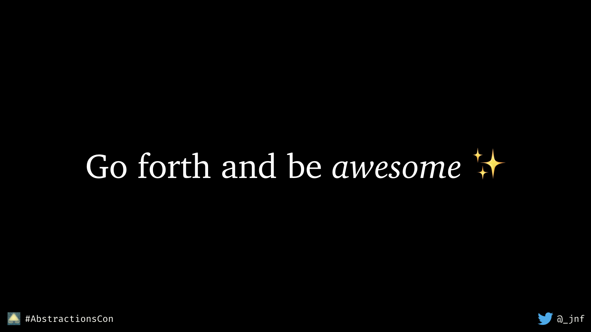
If you’ve ever attended one of my talks, you’ll recognize the central theme here. I mostly talk about either using your privilege to elevate others, or how software makes us feel and affects our relationships.

Today’s presentation has both. Normally, I end with the message *Go Forth, and be Awesome*, because, ideally, my presentation has left you inspired and motivated to use your privilege to elevate others and/or dig into how the software you make affects the human relationships it touches. This time, I’d like to flip the script and lead with this closer.

You **can**, **should**, and **are**, in some ways, **obligated** to use whatever privilege and leverage you have to elevate, promote, and otherwise help those around you. You exist at a specific moment in time and space in which you can affect great change, have tremendous impact. That feel heavy, because it is. But the good news is that there is so much that can be done, and little pebbles, fetched diligently, can move mountains. This talk is about one of the little pebbles, and the difference it’s made.

There are many wonderful, powerful people out there working every day to address inequity and injustice in our society. It’s hard, thankless work. This talk isn’t about them. It’s about the rest of us. Fundamentally, this talk is about micro aggressions and microaffirmations.

Microagressions are small, often unintentional, interactions that remind the marginalized of their oppression, or other the underrepresented, or just plain add resistance--friction and heat--to what should have been a frictionless moment.

Microaffirmations are the opposite. They are small, intentional signals that you--yes you--belong. Are part of the group, are recognized and valued. When you identify a behavior or pattern that is exclusionary, do the work to make it inclusive. That’s the job.

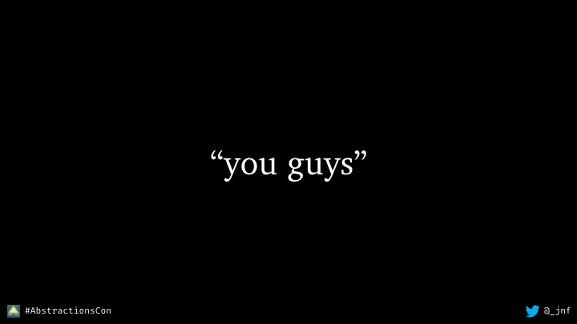
Here’s a relevant example. No matter your feelings on saying *you guys*, it’s totally possible (and I would argue totally trivial) to use a plethora of delightful alternatives: *friends*, *peeps*, *folks*, *heroes*, and, my absolute favorite *~yinz~*. Yinz is such a delightful word. Just perfect.

This idea of replacing microaggressions with microaffirmations extends to software. There are microaggressions in your code. In your user profiles, in your assumptions, in your practices, best and otherwise.

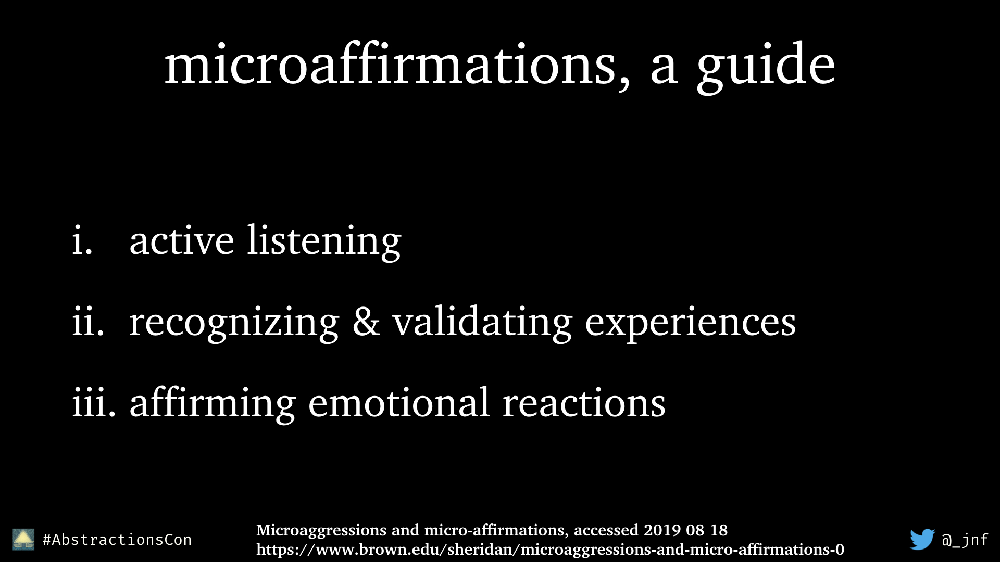
Fortunately, some really smart and kind folks over at Brown University [published a guide to correcting a micro-aggression with a micro-affirmation](https://www.brown.edu/sheridan/microaggressions-and-micro-affirmations-0).

Active listening, which focuses on hearing clearly what is being shared, and demonstrated through eye contact, open body posture, summarizing statements, and/or asking qualifying questions to ensure understanding.

Recognizing and validating experiences involves elucidating the what, why, and how. It is helpful to delve deeper by identifying and validating the constructive behaviors a student demonstrated to manifest or respond to the experience, expressing care about the effect of the event, and demonstrating a willingness to think through a productive path forward.

Affirming emotional reactions through verbal acknowledgement that they have experienced something exciting, frustrating, hurtful, etc. enables the conversation to focus on turning those feelings toward actions that will empower, heal, and/or foster learning.

### Warning! Flashing Colors Below

Let’s set the stage. Mighty AI was a startup that provided training data as a service. Leveraging an open community, we could and can create large, high quality datasets intended for training and validating computer vision models, primarily in the autonomous vehicle space. Here’s what it looks like. <play video>

My team creates and maintains the suite of web-based tools that make what you just saw possible. Those piece-meal segmentations were captured in a series of discrete tasks, independently verified, and combined to create the final instance or semantic segmentations. We pay per task, usually between one and three cents. It takes a fair amount of code to do this. And, because it’s the browser, the code is JavaScript, HTML, and CSS.

A significant portion of our tasking population lives in developing nations, with a large contingent living in Venezuela. This population developed organically, and I will forever be grateful to Mighty’s Community team for recognizing the group’s potential. The Community team leaned in hard, working with us to localize the interface in Spanish, hiring native speakers to act as community liaisons, and always always always ensuring we paid our annotators fairly and reliably, in USD. For much of our Venezuelan community, our annotation platform (called Spare 5) is their primary source of income.

There’s a small subsection of our community—called Super 5s—that do especially complicated tasks. They’re longstanding, highly-trusted individuals. We’re all in a Slack together. One day in February, J.G. shared the post above.

It was here that I realized the magnitude of the microagressions in our code base. JG was participating in a beta test of a new annotation tool that required downloading a large data payload. In this post, they do the math of how that 50mb payload meant they would lose money on the task, no matter what.

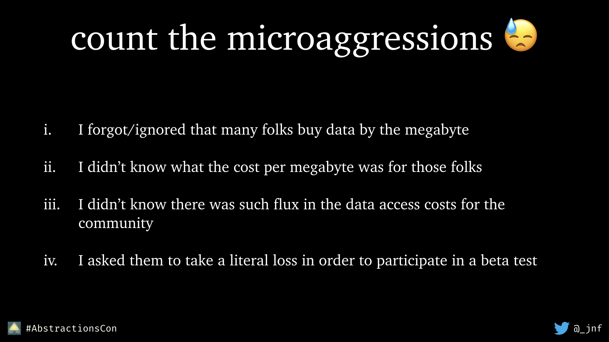

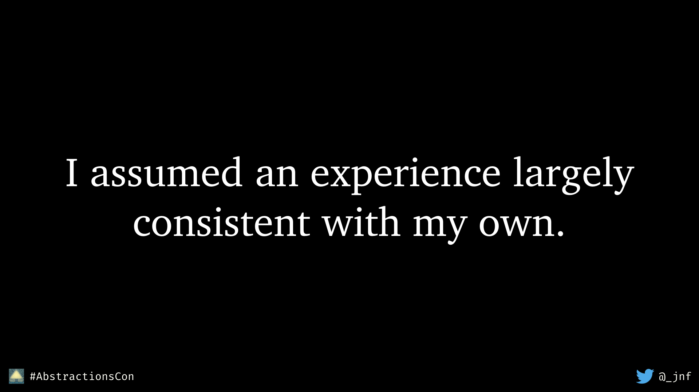

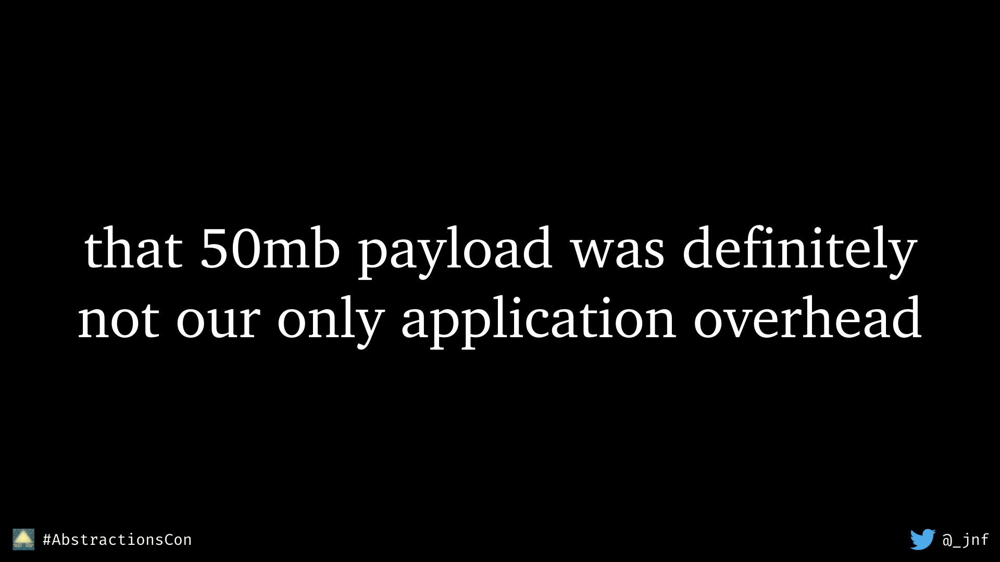
then i realized something else, that 50mb was for a beta test—it was a known ill that we would work to resolve as the product matured. that foresight doesn’t forgive the harm caused, by the way, but at least it was visible

Looking past that big rock, I realized there were definitely many other assets we expected folks to download everyday in order to use our platform.

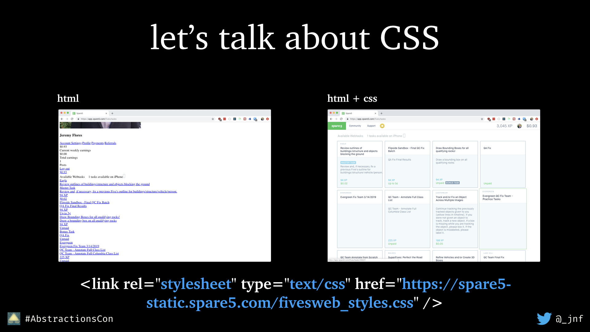

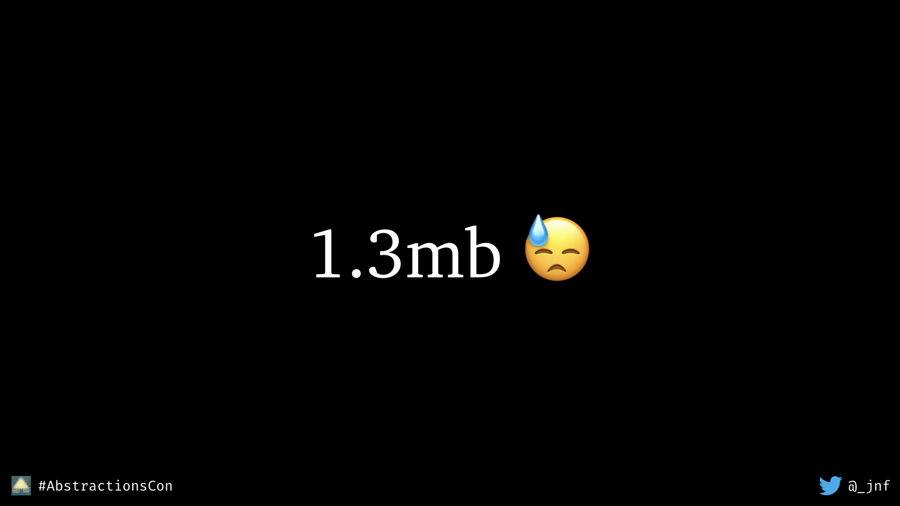
Back in February, when this story takes place, I was haunted by this number--1.3mb. That was the disk size of our production CSS bundle for our primary annotation client. That’s a lot of CSS.

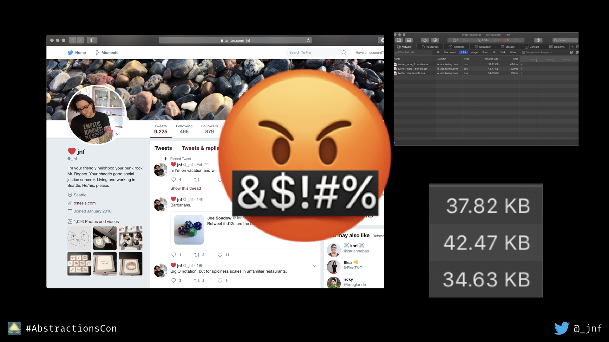
For contrast, just how much CSS does twitter need? Let’s pop open the developer tools and check. …that’s about 115kb.

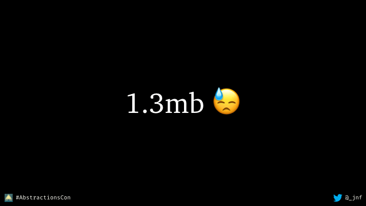
Ok, back to the 1.3mb in February. How did we get there? When I joined Mighty, the entire front-end was embedded in a Rails application. Over the next 18 months, my team and I worked to extract the front-end into standalone applications. One of the last threads to cut was the CSS; at the time, Rails was bundling our CSS, so making a style change necessitated a back-end deploy.

This bit of tech-debt had been in the backlog for awhile. I put it off, as we had many competing priorities, and they all had a better reward-to-effort ratio. Or so I thought. When we finally got into it, I realized how bad the problem was. There were multiple CSS frameworks referenced in the codebase. Percent utilization was extremely low--in the single digits for most pages. Also, at some point, we’d broken the minifier and hadn’t noticed. We removed the old frameworks, refactored some old components to use current styles and patterns, got our builds running outside of Rails, and, you know, fixed the minifier.

When we were done, the new CSS bundle weighed in at 34kb. Your move, twitter.

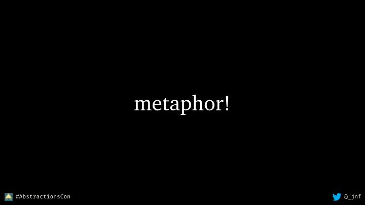
Our 5s pay a CSS tax, and we cut the tax rate by two orders of magnitude. That’s not a metaphor. I can quantify the tax rate. In February of 2019, it was between 0 and $0.18, depending on how much they tasked

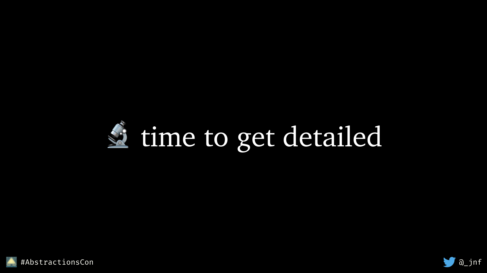
That feels kinda vague—0 to 18 cents—so let’s get detailed. I want to show how to apply a best practice like “have separate build and deploy pipelines for front end assets” maps to specific, tangible quality of life improvements.

First some facts, then some process, and finally some math.

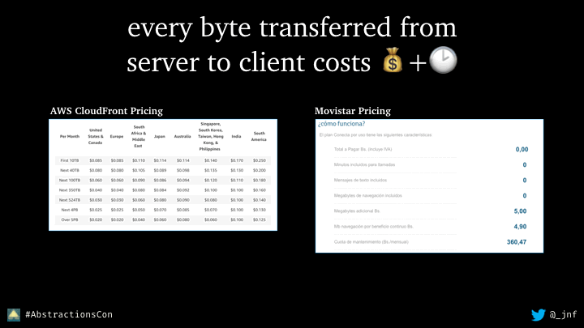
We pay AWS to store our bundles and deliver them, on demand, to users’ browsers. Our users pay their ISP to download and deliver the data they’ve requested. So every byte is paid for at least twice, but the cost scales are nowhere near balanced. AWS charges us **eight cents** for **ten terabytes** of transfer out of the CDN. Movistar, a cellular data provider operating in Venezuela, charges **5 Bss** (the local currency--more on that in a moment) **per megabyte**. Knowing this, we can derive exactly what a user will _spend_ in order to _earn_ on our platform.

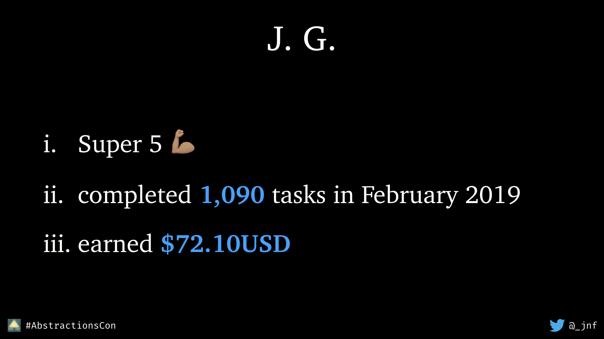
So let’s do that. JG is a Super5&mdash;a highly skilled and prolific annotator on our platform&mdash;living in Venezuela. During February 2019, JG completed 1,090 discrete tasks and earned $72.10USD.

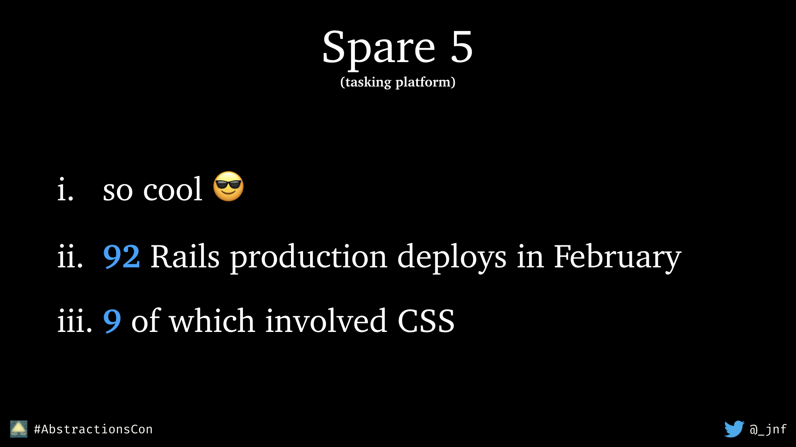
Spare5 is our annotation platform. During the same month, we deployed the Rails backend 92 times. Nine of those deployments contained CSS changes.

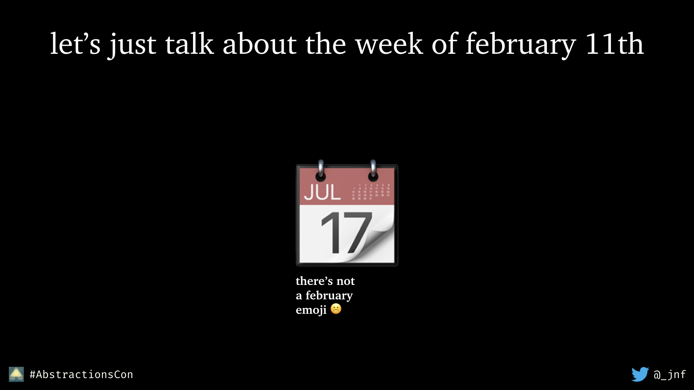
1090 tasks and 92 deploys are still pretty big numbers, so let’s drill down even further, and visualize the work JG did during just one week in February.

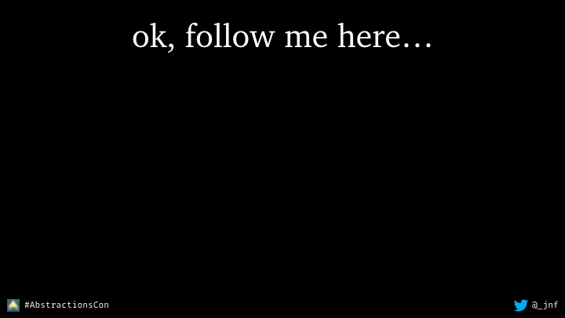
Here’s the only code in my entire talk, and it’s a truncated screenshot. To visualize the work JG completed, I...

- wrote a database query that returned each unit of work JG completed, along with when and how much they earned.
- then munged that through a Ruby script that grouped that time into _tasking sessions_, which I defined as consecutive work fifteen or fewer minutes between finishing one and starting the next.
- then exported that to a CSV file structured to be imported to Google Calendar.

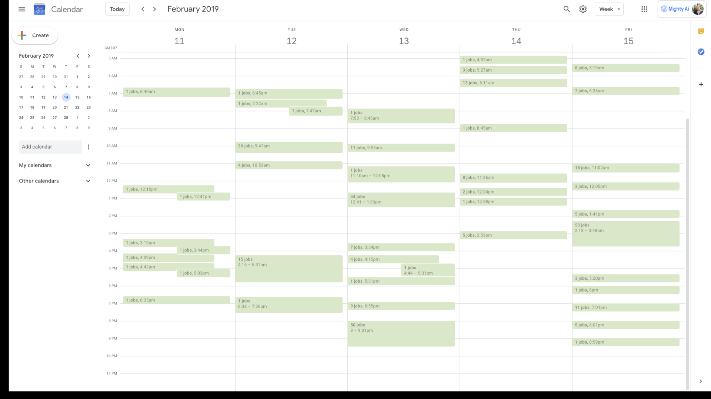
And there you go. One week of tasking sessions, in a calendar view. Hashtag manager life. Likely imperfect but representative of how JG spent their tasking time.

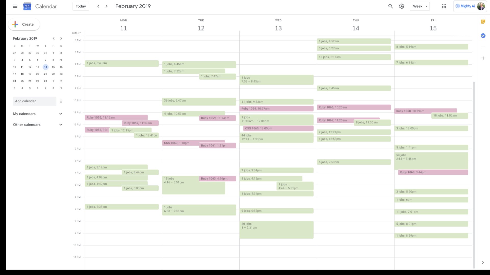
Using a similar approach, I can then overlay production deployments (in pink). At the time, these deployments included cache-busting the CSS bundle. During the same week, we had **13** deploys, of which only **2** contained actual CSS changes. Every green box after a pink box is a time we forced JG to re-download the CSS bundle, roughly 8-10 times.

Most of the time, even though we forced a re-download, it was _exactly the same CSS_.

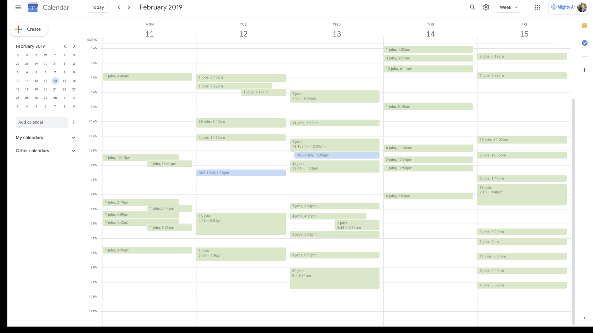
The CSS only changed twice, here, in blue.
Conservatively six unnecessary downloads, or **~7.5mb** of CSS JG isn’t going to use. For reference, the assets unique to a large task, assuming nothing cached, is about 2.5mb. So that’s three tasks we asked JG to download (and pay for), for the privilege of using our application.

Let’s connect it to our previous metaphor. During the week of 2/11. JG paid the CSS tax 8 times.

It should have been twice.

And it should’ve been far, far less

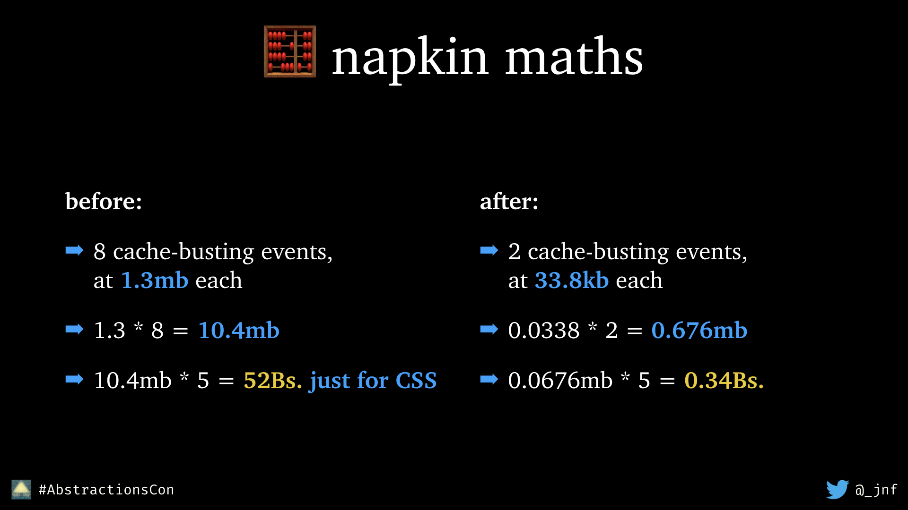
JG paid 52Bs. when it could and should have been 0.34Bs. And, to reiterate, this is _just for CSS, the vast majority of which was redundant or unreferenced_. It’s wholly unacceptable, especially given the volatility of the economy in Venezuela.

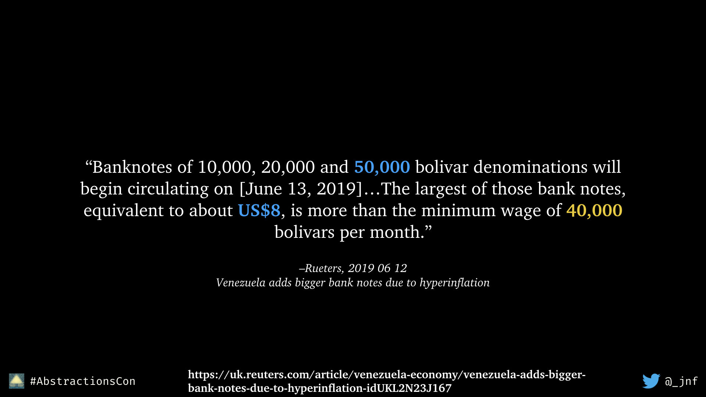
This is the second time in a year that the Venezuelan government has made a drastic change to their currency. One year ago yesterday _[Ed. note, that’s 21 August 2019]_, a new currency—the Bolívar Soberano—replaced the existing currency with a ratio of 100,000 to 1. The minimum wage at that time was 1,800 bolivars. It’s since increased to 40,000, but the actual value (as measured by exchange rates and local buying power) has decreased. In USD, the minimum wage has fallen from about $8USD to less than $3 ([source](https://uk.reuters.com/article/venezuela-economy/venezuela-adds-bigger-bank-notes-due-to-hyperinflation-idUKL2N23J167)).

While unorthodox, [Bloomberg’s "coffee index"](https://www.bloomberg.com/features/2016-venezuela-cafe-con-leche-index) is a very accessible and understandable look at hyperinflation.

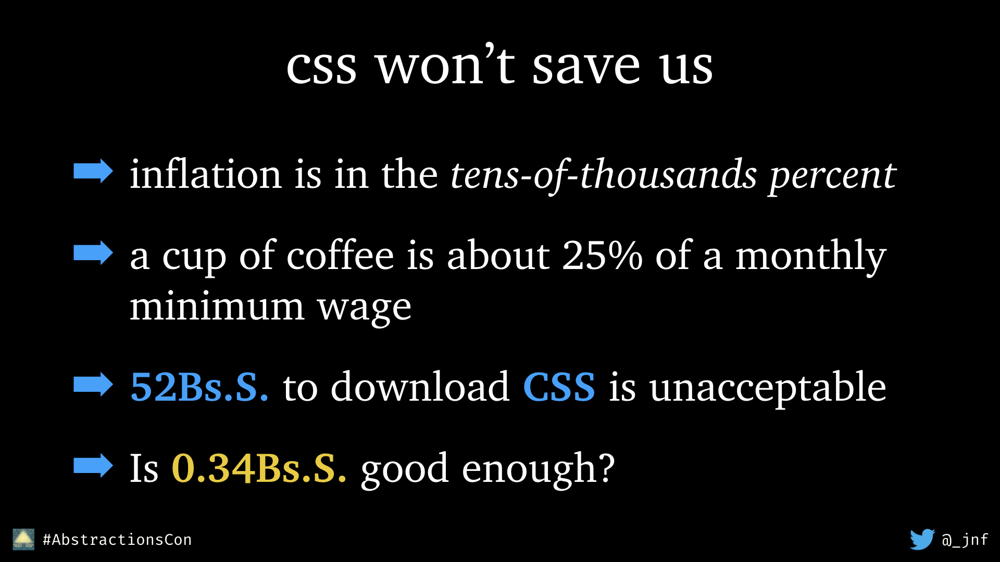

With changing the what and when and how of our CSS deploys, we’ve taken one little pebble from the mountain our community faces. And that’s how we move mountains, one little pebble at a time, all together. What’s happening in Venezuela is so far out of our control, but we can still help. We can listen, recognize and validate the experiences shared, and then adapt our perspective and efforts to better include and honor those experiences.

Getting our CSS under control benefits every single person using our application; keeping it under control shows we respect and value the people who’s lived experiences differ from our own. Having that closer connection to our community and seeking microaffirmation opportunities makes me a better engineering leader. It helps me prioritize the right efforts by providing much more meaningful and tangible measures of impact. I would encourage you to do better than I did. Don’t wait, don’t assume. Seek out the disempowered folks in your product’s communities. Don’t assume you know what would best help them. Don’t assume that your product backlog will solve their problems. Instead, reach out.

_Ask, listen, believe. And then act._

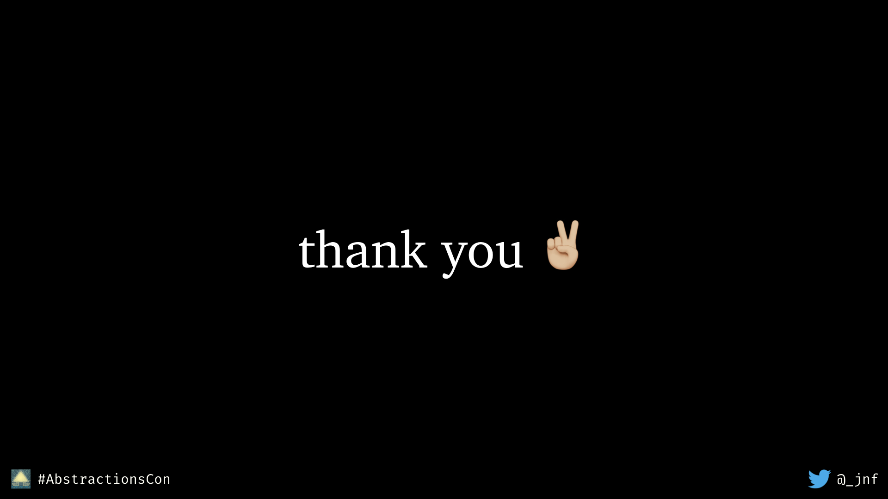
Thanks, friends. üíñ
